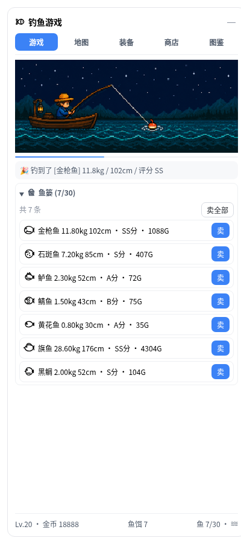
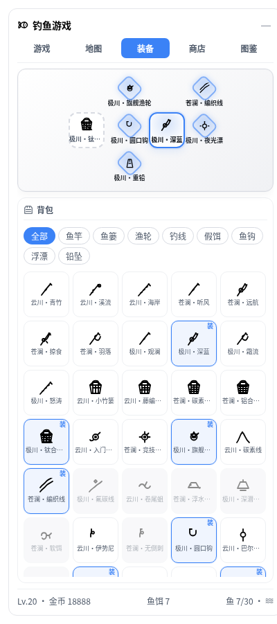
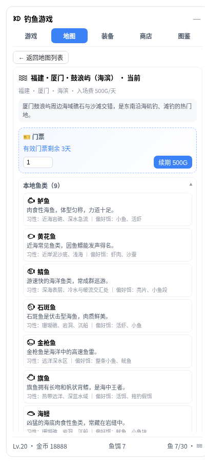
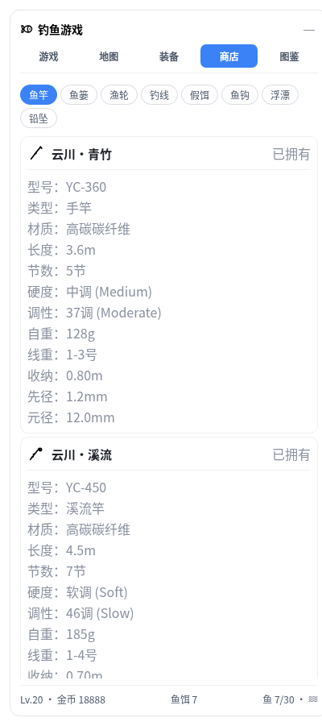
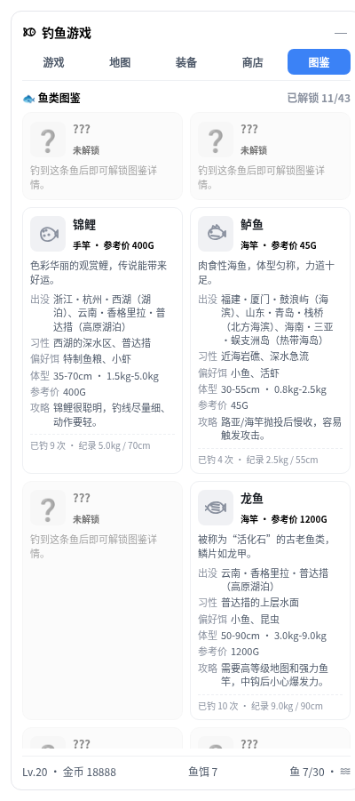

# @gitsang/dsh-fishing

A floating fishing game for the deepseek-harness **web** surface.

While you use the agent, token usage is collected as bait: every 1M consumed
tokens add 1 bait. Each cast consumes 1 bait, so the game casts the equipped
rod once per 1M tokens and catches a fish. Fish can be sold for coins; coins
buy different branded rod models. Rods no longer have levels or upgrade paths. Catching fish grants experience and raises your level;
higher levels unlock new maps. Except for the beginner map, entering another
map requires a ticket. Each ticket lasts one real day, and you can buy a
multi-day ticket at once. Different maps contain different fish, and there are
more rod/basket/accessory options to collect. Each newly caught fish unlocks
its entry in the in-game fish codex (图鉴), which records habitat, favorite
bait, tips, and your personal best catches.

The game is opened from the left sidebar: a `Fishing` button is placed above
the settings button and styled like the other sidebar buttons. Clicking it
opens the fishing panel directly in the sidebar.

## Screenshots







> 截图为侧栏钓鱼面板的静态示例；实际运行时会轮询实时快照并支持交互。

## How it works

- **Host half** (`src/index.js`): subscribes to `session/event`, reads
  `usage` from `assistant/message` and `compaction/summary` events, and feeds
  the game core. It exposes two HTTP endpoints:
  - `GET /fishing/snapshot` — current game snapshot JSON.
  - `POST /fishing/command` — send a command such as `{"type":"SellFish","fishId":"..."}`.
- **Game core** (`src/game.js`): species, rods, timed catch flow,
  catch/sell/upgrade rules. Each cast first enters a random 0-60s waiting
  stage, then a random 0-60s reeling stage; stage flavor/result events are read
  from the `FISHING_EVENTS` config table. It follows the same core model as the
  pi-fishing design doc, but does not import or depend on pi-fishing.
- **Browser half** (`src/client.js`): a `dsh.client` web plugin that registers
  a `Fishing` sidebar button into the layout's `sidebar.footer.action` slot and polls
  the snapshot endpoint.

## Install into a web profile

Add this package to the web profile's dependencies and bundles, for example in
`~/.dsh/profiles/web/package.json`:

```json
{
  "dependencies": {
    "@gitsang/dsh-fishing": "link:/path/to/dsh-fishing"
  },
  "dsh": {
    "profile": {
      "bundles": [
        "@deepseek-ai/dsh-base",
        "@deepseek-ai/dsh-web-app",
        "@gitsang/dsh-fishing"
      ]
    }
  }
}
```

Then install and launch:

```bash
cd ~/.dsh/profiles/web
pnpm install
dsh web
```

The host plugin's row is inserted by `cordis.patch.yml`; the browser plugin is
discovered automatically from the package's `dsh.client` declaration.

## State

State is stored under `$DSH_HOME/storages/dsh-fishing/` (default
`~/.dsh/storages/dsh-fishing/`):

- `state.json` — atomic snapshot, debounced writes.
- `events.jsonl` — append-only event/command log, used to rebuild best-effort
  state when `state.json` is missing or unreadable.

## Commands

The sidebar panel exposes the common actions. The raw HTTP API accepts these
command types:

- `SellFish` / `SellAllFish`
- `BuyRod` / `EquipRod`
- `BuyBasket` / `EquipBasket`
- `BuyAccessory` / `EquipAccessory` / `UnequipAccessory`
- `BuyTicket` / `ChangeMap` — buy multi-day map tickets and move between maps
  (e.g. `{"type":"BuyTicket","mapId":"forest_lake","days":3}`,
  `{"type":"ChangeMap","mapId":"forest_lake"}`). If a cast is in progress, it
  is cancelled and the consumed bait is refunded.

## Development notes

- The game tick interval is 500ms; the browser polls the snapshot every 500ms.
- Token count formula: `inputTokens + outputTokens + cacheReadTokens +
  cacheWriteTokens` (falling back to `input/output/cacheRead/cacheWrite` field
  names when present).
- The widget is intentionally self-contained: the client only talks to
  `/fishing/*`; it does not import any pi-fishing code.
